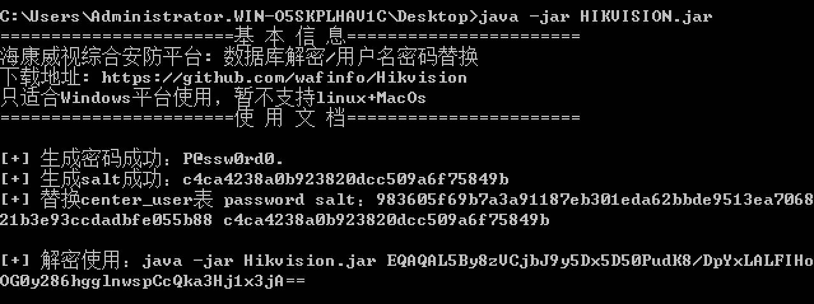
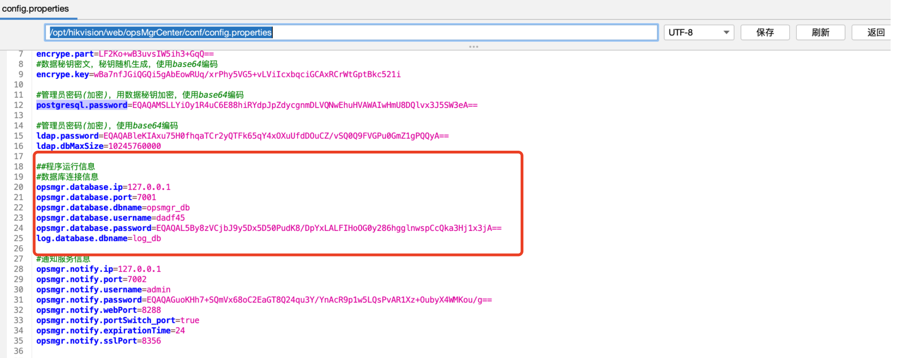
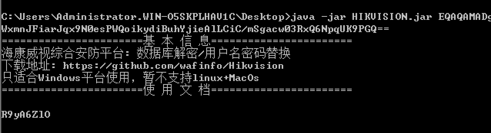

# 海康威视综合安防平台后渗透利用工具

# 👮🏻‍♀️ 免责声明

由于传播、利用Hikvision工具提供的功能而造成的**任何直接或者间接的后果及损失**，均由使用者本人负责，本人**不为此承担任何责任**。

##  使用环境

该工具只适合Windows使用，不支持Linux/Macos。

## 使用流程介绍

直接运行Hikvision.jar输出替换sysadmin用户password和salt。

运行管理中心地址：http://xxxxxx:8080/center/login

直接运行Hikvision.jar 加密的密码，输出解密后的内容。

